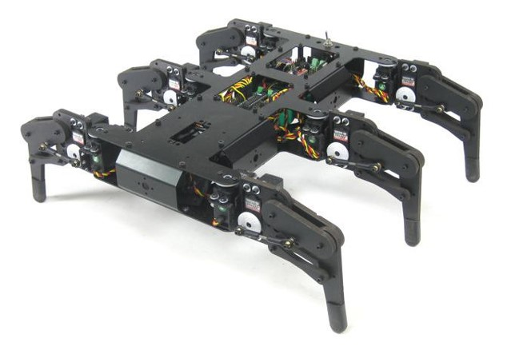
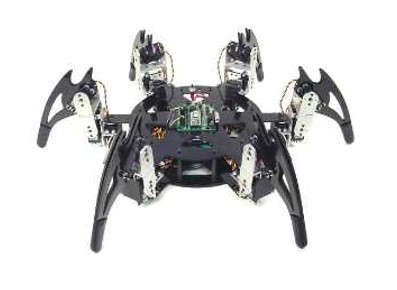
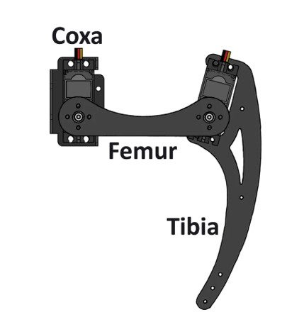

# Hexapod Research

## What is a hexapod?
A hexapod is a six-legged robot designed to move using coordinated leg patterns called gaits. Because it has six legs, it can keep several points of contact with the ground at the same time, making it more stable on uneven or difficult terrain.

## Why six legs?

At the beginning of the project, I considered using a four-legged design instead of a hexapod. A quadruped would probably be faster, more agile, and more flexible in terms of movement. However, it would also require more precise balance control, stronger mechanical design, and more complex movement algorithms. For this project, stability and adaptability to uneven terrain are more important than speed. A six-legged robot can keep more contact points with the ground, making it more stable and reliable on difficult surfaces. For that reason, the hexapod structure is a better fit for the goal of this robot.

## Types of Hexapods
Another important design decision was the type of hexapod structure I wanted to build. Depending on the body shape and leg distribution, I had to choose between a rectangular, tank-like architecture and a hexagonal architecture. In general, a rectangular hexapod tends to perform better in straight-line walking, while a hexagonal hexapod usually has advantages in turning movements. Assuming the same leg design and overall robot size, the hexagonal configuration can provide better turning ability, a higher stability margin, and, in some conditions, a greater stride length.

For this reason, the body architecture has a direct impact on the robot’s movement capabilities, stability, and adaptability to different terrains.

### Rectangular / Tank-like Architecture

### Hexagonal Architecture

## Legs

The final design decision was whether the legs should have a straight structure or a curved, C-shaped structure. After comparing both options and analysing their advantages and limitations, I decided that the curved design was the most suitable for this project.The main advantage of a straight leg is that the contact point with the ground is clearly defined. This makes the final position of the leg easier to calculate and predict, which simplifies stability analysis and movement control.However, a curved leg offers greater versatility. Its shape is more similar to a biological leg, and it allows the robot to support itself using different parts of the leg depending on the terrain. This makes it more suitable for irregular surfaces, as the contact with the ground is more progressive and less abrupt.

The main drawback of this design is that the support point is harder to predict. As a result, calculating the exact position, stability margin, and effective leg length becomes more complex. Even so, the curved structure is still the better option for this robot, as it improves adaptability to uneven terrain and allows the robot to tolerate small positioning errors and changes in elevation.

So, this is the final shape the legs will have:

The legs will have each one three servo motors, each one for the coxa, femur and shinbone.

## 4 Degrees of freedom?

While researching other hexapod projects, I found a design in which each leg had four degrees of freedom instead of three. This made me consider whether adding an extra degree of freedom to each leg would be worth it for my own robot. A fourth degree of freedom, acting similarly to an ankle joint, could improve the robot’s contact with the ground, stability, terrain adaptability, and overall leg movement. It would also make the motion more natural and biologically inspired, especially when walking on uneven surfaces.

However, adding one more servo to each leg would increase the total number of servos from 18 to 24. This would significantly increase the robot’s weight, power consumption, mechanical complexity, and overall cost. It would also make the control system more difficult to manage. For this reason, I decided to keep the current three-degree-of-freedom leg design. Although a fourth joint could provide some advantages, the existing configuration already fits the goals of the project well. It offers a good balance between mobility, stability, complexity, and cost, making the extra degree of freedom unnecessary for this version of the robot.

## Gaits

A gait is the sequence in which a robot moves its legs. In hexapod locomotion, each gait provides a different balance between stability, speed, complexity, and terrain adaptability.

### Wave Gait

The wave gait moves one leg at a time. In this project, the movement starts from the rear legs of one side and then continues with the legs on the opposite side. Since most of the legs remain in contact with the ground during the movement, this is one of the most stable gaits. However, it is also one of the slowest. For that reason, it is especially useful on irregular or difficult terrain, where stability is more important than speed. It can also be useful when the robot needs to carefully avoid, climb over, or pass through obstacles.

### Ripple Gait

The ripple gait moves pairs of legs in a coordinated sequence. Unlike the wave gait, more than one leg can be involved in the movement cycle, which makes it faster. However, the sequence is still designed to keep enough legs on the ground to maintain good stability. This gait provides a balance between the high stability of the wave gait and the higher speed of the tripod gait. It is suitable for situations where the robot needs to move more efficiently while still maintaining reliable ground contact.

### Tripod Gait

The tripod gait moves two groups of three legs alternately and is one of the most common gaits used in hexapod robots. It is usually the fastest gait because half of the legs move while the other half support the body. 
The main drawback is that it is less stable than the wave and ripple gaits, since fewer legs remain on the ground during each movement phase. For this reason, the tripod gait is better suited to flat and predictable surfaces, where speed is more important than maximum stability.

A useful visual explanation of these gait patterns can be found here:
https://youtu.be/wScEFaoqwPM?si=5yplI5DwsEK35SKu

## Static vs dynamic gait

## Wave gait

## Ripple gait

## Tripod gait

## Other possible gaits

## Useful references

## Wave gait

The wave gait moves one leg at a time. This keeps five legs on the ground, making it one of the most stable gaits. However, it is slower than ripple or tripod gait.

## Ripple gait

The ripple gait moves legs in a sequential pattern, usually with more than three legs on the ground. It is a compromise between stability and speed.

## Tripod gait

The tripod gait moves two groups of three legs alternately. It is faster, but less stable than wave or ripple gait.
